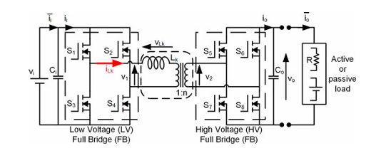
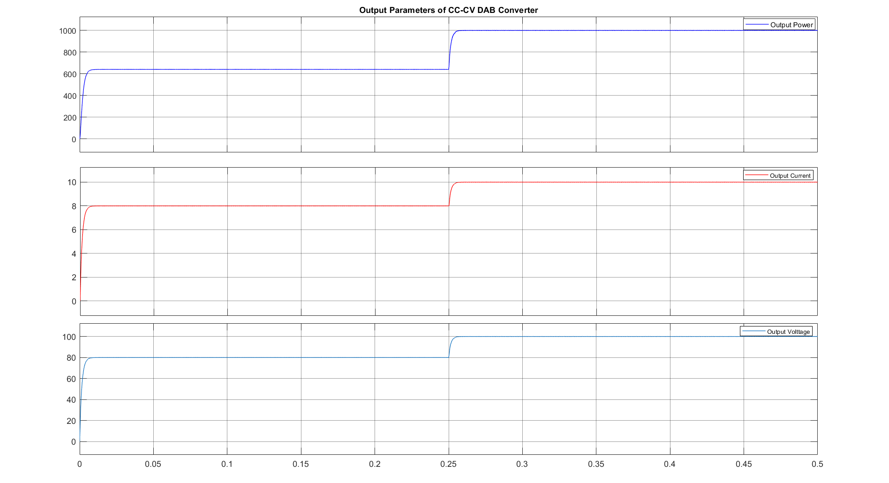
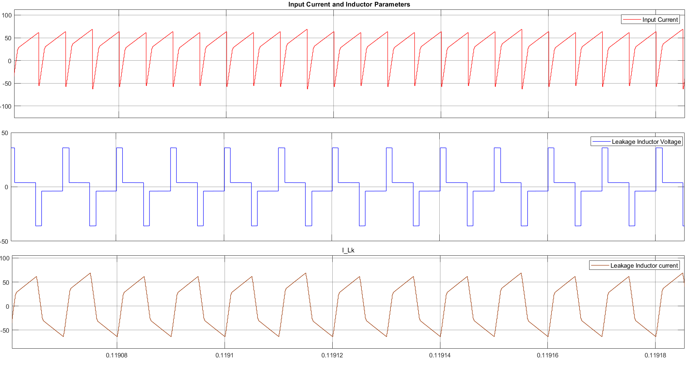
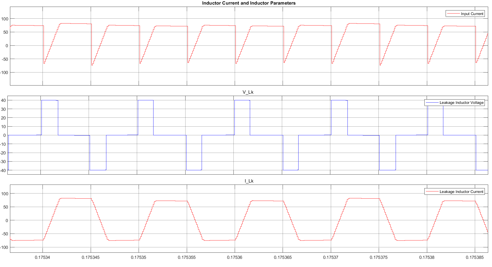
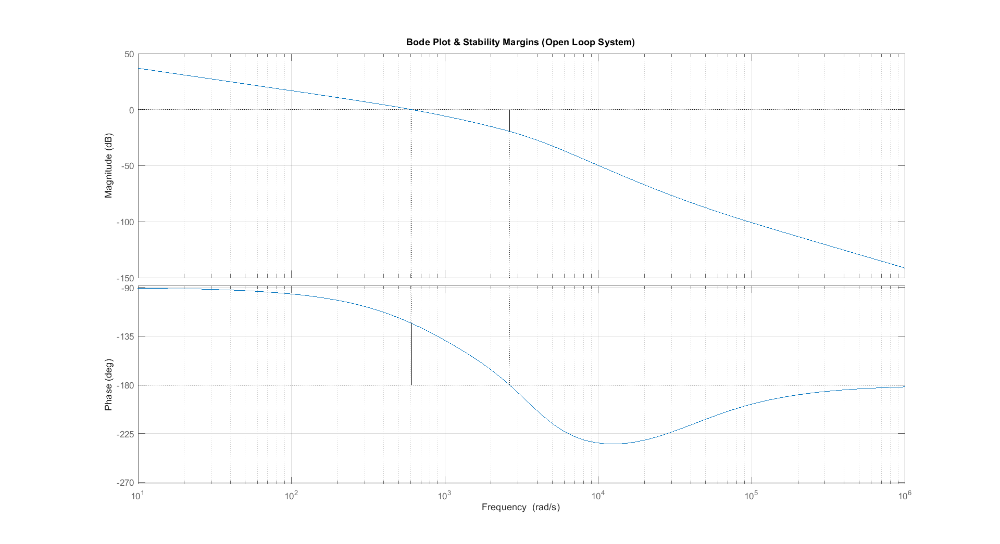
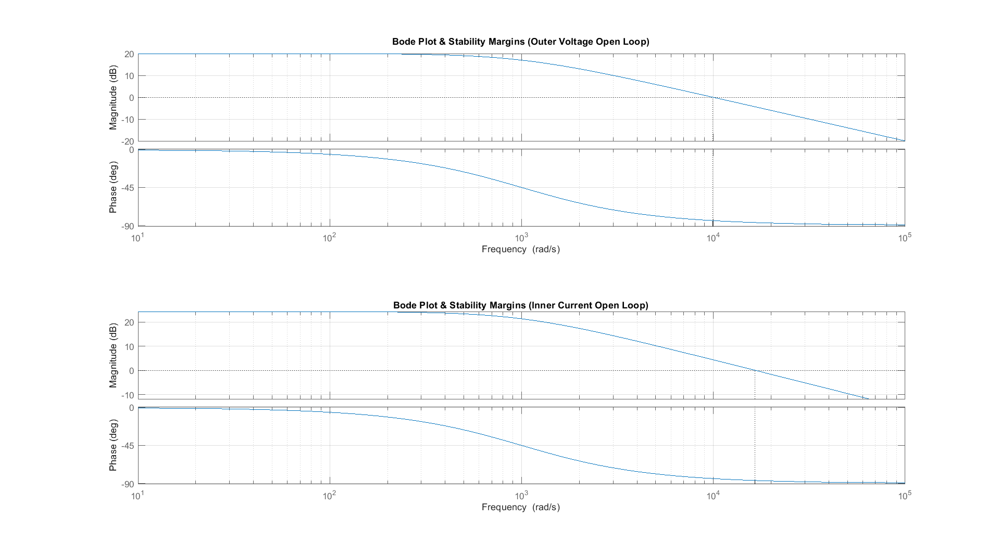
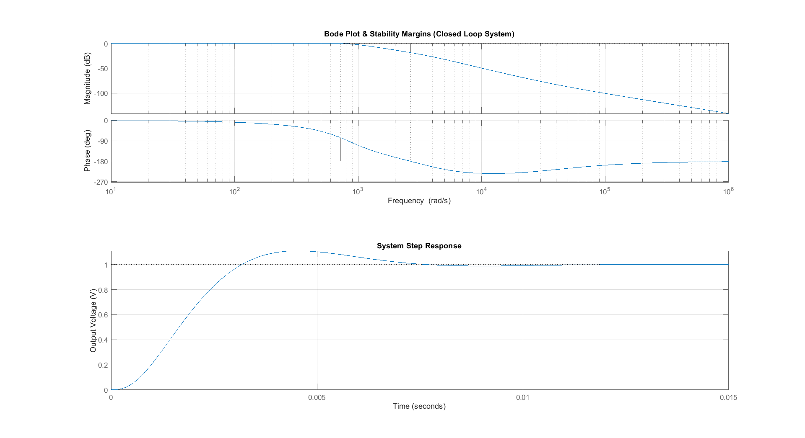

# Dual Active Bridge (DAB) Converter using Single Phase Shift (SPS) Control

> MATLAB/Simulink implementation evaluation of Single Phase Shift (SPS) control strategies for Dual Active Bridge (DAB) DC–DC converters.


## Project Overview

The Dual Active Bridge (DAB) converter is a bidirectional isolated DC–DC converter that is widely used in electric vehicles, battery energy storage systems, renewable energy interfaces, and high-power DC microgrids because of its high efficiency, galvanic isolation, and capability for bidirectional power transfer.

<p align="center">
  
</p>

<p align="center">
  <em><strong>Figure 1.</strong> Schematic diagram for the Dual active Bridge (DAB) converter.</em>
</p>

This repository presents MATLAB/Simulink implementations of Single Phase Shift (SPS) controlled DAB converters developed to study and compare different SPS design methodologies reported in the literature. The work includes the reproduction and evaluation of published design strategies aimed at extending the Zero Voltage Switching (ZVS) operating range, improving converter efficiency, and implementing a Constant Current–Constant Voltage (CC–CV) charging strategy for a resistive load.

Rather than focusing on a single simulation model, this repository demonstrates the complete engineering workflow—from analytical design and parameter calculation to Simulink implementation and performance verification. The objective is to provide a clear understanding of how different SPS control approaches influence converter operation under various design goals.

This project was carried out as part of my self-learning and research activities in Power Electronics to strengthen my understanding of DAB converter design, control strategies, and simulation-based validation using MATLAB and Simulink.

## Objectives

The primary objectives of this project are:

- Develop a comprehensive understanding of the operating principles of the Dual Active Bridge (DAB) DC–DC converter under Single Phase Shift (SPS) control.

- Implement and validate published SPS-based design methodologies in MATLAB and Simulink to reproduce their reported operating characteristics.

- Investigate the influence of different SPS design approaches on key converter performance metrics, including Zero Voltage Switching (ZVS) operating range and converter efficiency.

- Analyze converter behavior through steady-state simulation, electrical waveforms, and power transfer characteristics.

- Develop a script-assisted Constant Current–Constant Voltage (CC–CV) charging model using SPS modulation for a resistive load.

- Establish a modular simulation framework that can serve as the foundation for implementing more advanced DAB modulation strategies such as Extended Phase Shift (EPS), Dual Phase Shift (DPS), and Triple Phase Shift (TPS).

## Project Workflow

The development of this project followed a structured engineering workflow, beginning with the study of published research and progressing through analytical design, simulation development, and performance evaluation.

```text
Research Paper Review
        │
        ▼
Understanding DAB Operation & SPS Modulation
        │
        ▼
Analytical Design Methodology
        │
        ▼
MATLAB Design Scripts
        │
        ▼
Simulink Model Development
        │
        ├──────────────┐
        ▼              ▼
   ZVS Design      Maximum Efficiency Design
        │              │
        └──────┬───────┘
               ▼
      CC-CV Charging Model
               │
               ▼
Simulation Results & Performance Verification
```

## Repository Organization

The repository is organized to separate simulation models, analytical scripts, documentation, and simulation results, making the project easy to understand, reproduce, and extend.

| Directory | Description |
|-----------|-------------|
| **docs/** | Project documentation and references to the research papers used in this work. |
| **models/** | MATLAB/Simulink (`.slx`) implementations of the SPS-controlled DAB converter. |
| **scripts/** | MATLAB (`.m`) scripts for converter design, parameter calculation, and simulation support. |
| **results/** | Simulation waveforms, plots, and performance comparison figures. |
| **images/** | Images, diagrams, and screenshots used in the project documentation and README. |

The repository has been structured so that each component of the project can be understood independently while maintaining a clear workflow from analytical design to simulation and performance evaluation.

## Simulation Models

This repository contains three MATLAB/Simulink implementations of Single Phase Shift (SPS) controlled Dual Active Bridge (DAB) converters. The models are based on established literature and demonstrate different design objectives ranging from extending the Zero Voltage Switching (ZVS) operating range to implementing a Constant Current–Constant Voltage (CC–CV) charging strategy.

---

### 1. SPS Design for Extended ZVS Range

The repository includes three MATLAB/Simulink implementations of Single Phase Shift (SPS) controlled Dual Active Bridge (DAB) converters. Each model was developed with a distinct engineering objective, ranging from extending the Zero Voltage Switching (ZVS) operating range to implementing a Constant Current–Constant Voltage (CC–CV) charging strategy.


| Model | Engineering Objective | Based On | Key Contribution |
|:------|:----------------------|:---------|:-----------------|
| **Model 1** | Extend the Zero Voltage Switching (ZVS) operating range | Rodríguez *et al.* | Demonstrates an SPS design methodology focused on achieving wider soft-switching operation. |
| **Model 2** | Maximize converter efficiency at rated operating conditions | Rodríguez *et al.* | Implements an efficiency-oriented SPS design methodology to reduce converter losses. |
| **Model 3** | Constant Current–Constant Voltage (CC–CV) charging using SPS control | Fundamental DAB theory by Mi *et al.* | MATLAB-assisted analytical design and Simulink implementation of a closed-loop SPS-controlled DAB converter for a resistive load. |

**Objective**

Increase the Zero Voltage Switching (ZVS) operating range of the DAB converter.

**Description**

This model implements the ZVS-oriented design methodology proposed by **Rodríguez et al.**, demonstrating how appropriate converter design choices can significantly extend the soft-switching operating region while maintaining effective power transfer.

**Reference**

Rodríguez, A., Vázquez, A., Lamar, D. G., Hernando, M. M., & Sebastián, J., *Different Purpose Design Strategies and Techniques to Improve the Performance of a Dual Active Bridge With Phase-Shift Control.*

---

<p align="center">
  
</p>

<p align="center">
  <em><strong>Figure 2.</strong> Simulink Model of the Dual active Bridge (DAB) converter used to validate both the designs i.e. design 1 and 2.</em>
</p>

### 2. SPS Design for Maximum Efficiency

**Objective**

Improve converter efficiency under rated operating conditions.

**Description**

This model implements the efficiency-oriented design methodology proposed by **Rodríguez et al.**, where converter parameters are selected to minimize conduction losses and improve overall efficiency instead of maximizing the ZVS operating range.

**Reference**

Rodríguez, A., Vázquez, A., Lamar, D. G., Hernando, M. M., & Sebastián, J., *Different Purpose Design Strategies and Techniques to Improve the Performance of a Dual Active Bridge With Phase-Shift Control.*

---

### 3. SPS-Based Constant Current–Constant Voltage (CC–CV) Charging

**Objective**

Develop a closed-loop SPS-controlled DAB converter capable of Constant Current–Constant Voltage charging of a resistive load.

**Description**

Unlike the previous two models, this implementation combines analytical parameter calculations using MATLAB with a Simulink-based closed-loop DAB model. The controller and charging strategy were developed by extending the fundamental DAB operating principles presented by **Mi et al.**, demonstrating practical implementation of SPS modulation for CC–CV operation.

**Reference**

Mi, C., Bai, H., Wang, C., & Gargies, S., *Operation, Design and Control of Dual H-Bridge-Based Isolated Bidirectional DC–DC Converter.*

<p align="center">
  
</p>

<p align="center">
  <em><strong>Figure 2.</strong> Simulink Model of the Dual active Bridge (DAB) converter for CC-CV, cascaded closed Loop .</em>
</p>

## Software & Tools

The project was developed and validated using the following software tools:

| Software | Purpose |
|----------|---------|
| **MATLAB** | Analytical calculations and converter parameter design |
| **Simulink** | Dynamic modelling and simulation of the DAB converter |
| **Simscape Electrical** | Power electronics component modelling |
| **Git & GitHub** | Version control and project documentation |

## Simulation Specifications

The simulations were performed using the following converter specifications.

| Parameter | Symbol | Value |
|-----------|:------:|------:|
| Input Voltage | $V_1$ | 20 V |
| Output Voltage | $V_2$ | 100 V *(or your value)* |
| Switching Frequency | $f_s$ | 100 kHz |
| Transformer Turns Ratio | $n$ | 5 |
| Leakage Inductance | $L$ | calculated by the script |
| Output Capacitance | $C$ | calculated by the script |
| Load | $R$ | calculated by the script |
| Control Strategy | — | Single Phase Shift (SPS) |

## Results

### Output Parameters

<p align="center">
  
</p>
<p align="center">
  <em><strong>Figure 7.</strong> Output power, current and voltage of the SPS-controlled DAB converter under cascaded control CC-CV.</em>
</p>

### Input Parameters

<p align="center">
  
</p>
<p align="center">
  <em><strong>Figure 7.</strong> Leakage Inductor Parameters for Step 1 i.e. at 80% load.</em>
</p>

<p align="center">
  
</p>
<p align="center">
  <em><strong>Figure 7.</strong> Leakage Inductor Parameters for Step 2 i.e. at full load.</em>
</p>

### Frequency Response (Bode Plots)

<table align="center">
<tr>
<td align="center">
<br>
<b>Figure 1.</b> Bode magnitude response.
</td>

<td align="center">
<br>
<b>Figure 2.</b> Bode phase response.
</td>

<td align="center">
<br>
<b>Figure 3.</b> Combined frequency response.
</td>
</tr>
</table>

## Engineering Highlights

- MATLAB/Simulink implementation of three SPS-controlled DAB converter models.
- Comparative study of ZVS-oriented and efficiency-oriented converter design methodologies.
- Script-assisted converter parameter calculation.
- Closed-loop Constant Current–Constant Voltage (CC–CV) charging implementation.
- Performance evaluation through simulation-based verification.
- Modular project structure for future implementation of EPS, DPS, and TPS modulation strategies.

## Key Learning Outcomes

- Understanding of DAB power transfer using SPS modulation.
- Practical implementation of published converter design methodologies.
- MATLAB-based analytical design and parameter calculation.
- Development and verification of Simulink models.
- Comparative evaluation of ZVS-oriented and efficiency-oriented converter designs.
- Foundation for implementing advanced modulation techniques such as EPS, DPS, and TPS.

## Future Work

The current repository focuses on Single Phase Shift (SPS) modulation. Future developments include:

- Extended Phase Shift (EPS) modulation.
- Dual Phase Shift (DPS) implementation.
- Triple Phase Shift (TPS) implementation.
- Optimization of operating trajectories.
- Reduction of circulating current and backflow power.
- Lookup table (LUT) generation for optimal control.
- Experimental hardware validation.

## References

The complete bibliography of the research papers used in this project is available in:

```text
docs/references.md
```

## Acknowledgements

This work was inspired by the research experience gained during my Summer Research Internship at IIT Kanpur. I sincerely thank my faculty supervisor and mentors for providing the opportunity, guidance, and exposure to advanced research in Power Electronics, which motivated the continued exploration presented in this repository.
